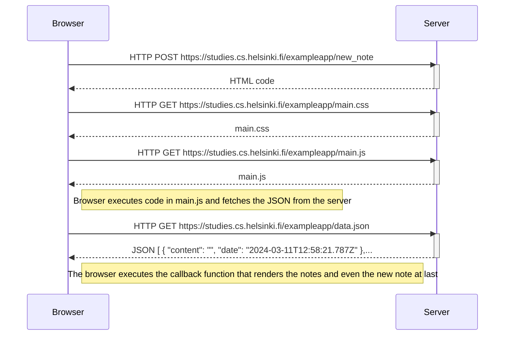

```mermaid
sequenceDiagram

participant A as Browser
participant B as Server

A ->> B :HTTP POST https://studies.cs.helsinki.fi/exampleapp/new_note
activate B
B -->> A : HTML code
deactivate B

A ->> B: HTTP GET https://studies.cs.helsinki.fi/exampleapp/main.css
activate B
B -->> A : main.css
deactivate B

A ->> B : HTTP GET https://studies.cs.helsinki.fi/exampleapp/main.js
activate B
B -->> A: main.js
deactivate B

Note right of A: Browser executes code in  main.js and  fetches the JSON from the server

A ->> B : HTTP GET https://studies.cs.helsinki.fi/exampleapp/data.json
activate B
B -->> A: JSON  [ {  "content": "",   "date": "2024-03-11T12:58:21.787Z" },...
deactivate B

Note right of A: The browser executes the callback function that renders the notes and even the new note  at last
 
```
